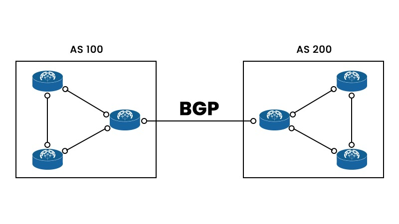
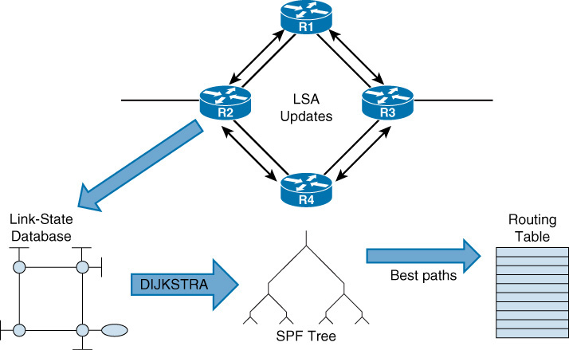
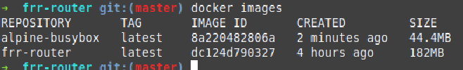

# BGP-AS Project Guide



## Overview
This project focuses on **network simulation and configuration** using **BGP EVPN, VXLAN, GNS3, and Docker**. You will work with routing protocols like **BGP (MP-BGP), OSPF, and IS-IS**, simulating a virtualized data center network.

---

## What is OSPF?




### **Open Shortest Path First (OSPF)** 

- OSPF, short for Open Shortest Path First, is a dynamic routing protocol commonly used in large-scale IP networks. It functions by determining the shortest path to route data packets between routers. OSPF calculates this path based on various metrics such as link bandwidth, delay, and cost.
At its heart, OSPF is a routing protocol built for the Internet Protocol (IP) networks. It operates within an Autonomous System (AS) — a collection of IP networks and routers under the control of one entity that presents a common routing policy to the Internet.

📖 **References:** 

- 📺 [What is OSPF and why do we need it?](https://www.fs.com/blog/what-is-ospf-and-why-do-we-need-it-1861.html)

- 📺 [OSPF Explained](https://www.youtube.com/watch?v=kfvJ8QVJscc&ab_channel=CertBros)

- 📺 [OSPF Implementation](https://www.ciscopress.com/articles/article.asp?p=2294214)

## What is BGP?
### **Border Gateway Protocol (BGP)** – A Path Vector Routing Protocol

### **Autonomous System (AS)**
- An **Autonomous System (AS)** is a group of networks and gateways managed by a single administrative authority.
- Gateways within the same AS are called **interior neighbors**, while those in different ASes are **exterior neighbors**.
- Each AS has a **routing policy** that dictates how it announces and receives route advertisements.
- ASes announce their routing policies using **BGP**, which is crucial for routing packets across the internet.

📖 **Reference:** [Cloudflare - What is an Autonomous System?](https://www.cloudflare.com/en-gb/learning/network-layer/what-is-an-autonomous-system/)

### **Static vs. Dynamic Routing**
- **Static Routing**: Configured manually, does not change unless modified by an administrator.
- **Dynamic Routing (BGP)**: Used by **ISPs and data centers**, dynamically updates routes based on changes in the network.

### **RFC Definition of BGP**
> "The primary function of a BGP-speaking system is to exchange network reachability information with other BGP systems. This includes the list of Autonomous Systems (ASes) that routing information traverses, allowing the construction of an AS connectivity graph for reachability and policy enforcement."

### **Cloudflare's Explanation of BGP**
- **BGP enables the internet** by allowing ASes to announce the IP addresses they manage and their connectivity to other ASes.
- BGP routers **update routing tables dynamically** to ensure efficient packet delivery.
- Changes in AS routing policies affect global internet routing.

📖 **Reference:** [Cloudflare - What is BGP?](https://www.cloudflare.com/en-gb/learning/security/glossary/what-is-bgp/)

### **Video Resources**
- 📺 [How BGP Connects the Internet](https://www.youtube.com/watch?v=A1KXPpqlNZ4&ab_channel=EyeonTech)

---

## Project Breakdown

### **Part 1: Setting Up GNS3 and FRRouting**

#### **GNS3 Docs**
- 📺 [GNS3 Docs](https://docs.gns3.com/docs/getting-started/your-first-gns3-topology)
- 📺 [GNS3 Demo](https://www.youtube.com/watch?v=Ibe3hgP8gCA&ab_channel=DavidBombal)

#### **FRRouting (FRR) Demo**
- 📺 [FRR Routing Site definition](https://frrouting.org/)
- 📺 [FRR Routing Demo](https://www.youtube.com/watch?v=D4nk5VSUelg&ab_channel=AhmadNadeem)

#### **Install GNS3 on Linux Mint**
📖 [GNS3 Installation Guide](https://docs.gns3.com/docs/getting-started/installation/linux/)

**After installation, verify the installation by running:**
```bash
gns3 &
```
**GNS3 Configuration:**
- **Server Type:** Local
- **Server Path:** `/usr/bin/gns3server`
- **Host Binding:** `localhost`
- **Port:** `3080 TCP`

#### **Creating Docker Images**
1. **BusyBox Docker Image**
2. **FRRouting (FRR) Docker Image**

Once these images are created using Dockerfiles, **build them for use in GNS3**. Check the **shell script** in the `confs` folder (Part 1).

📌 **After creating the images:**



#### **Building the Network in GNS3**
Now, we will:
- **Create a router based on the FRR image**
- **Create a host based on the Alpine image**
- **Configure GNS3 to work with Docker**

📺 **Video Tutorial:** 

https://github.com/user-attachments/assets/7f70fdba-7bc8-47a9-9401-93ec3f0ed3ed

