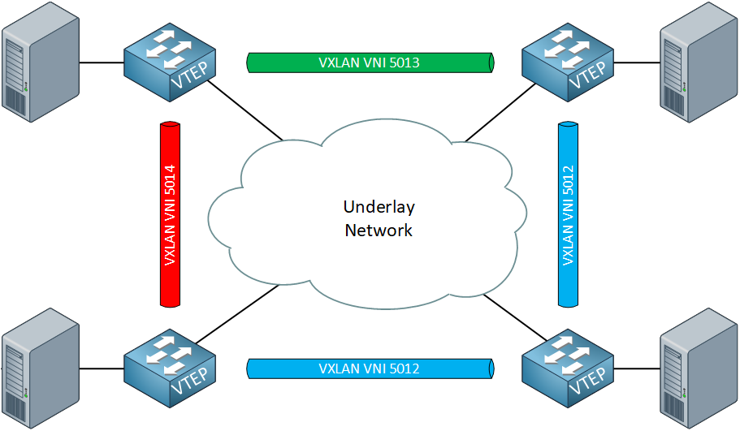
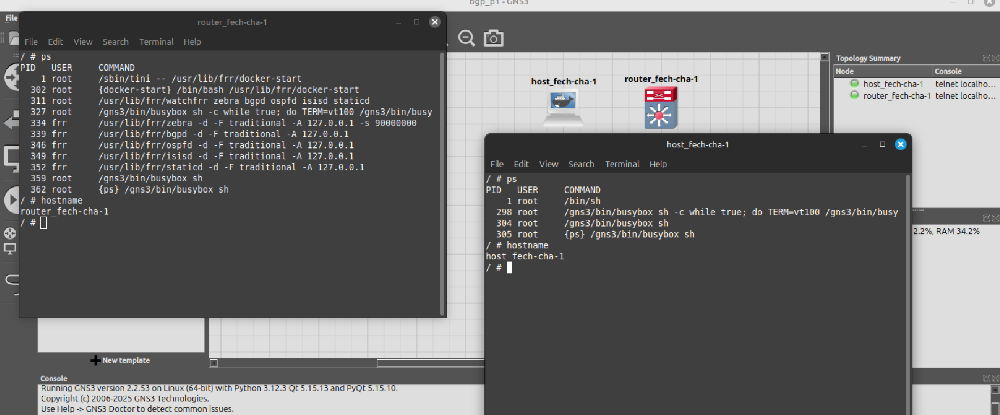
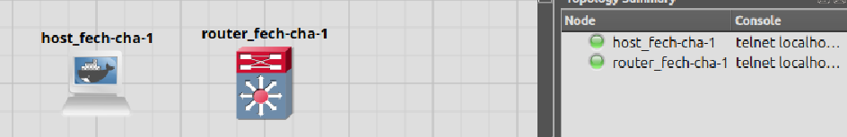
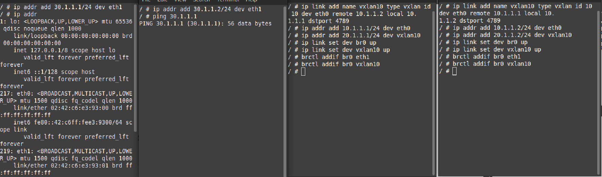

# BGP-AS Project Guide


## Overview
This project focuses on **network simulation and configuration** using **BGP EVPN, VXLAN, GNS3, and Docker**. You will work with routing protocols like **BGP (MP-BGP), OSPF, and IS-IS**, simulating a virtualized data center network.

---

## Dynamic Routing:

Dynamic routing, sometimes called adaptive routing, is more complex than static routing because it creates more possible routes to send packets across a network. Dynamic routes are typically used in larger, fluid networks where static routes would be cumbersome to maintain and frequently reconfigure. Because dynamic routing is more complicated, it consumes more bandwidth than static routing.

Dynamic routing uses algorithms to compute multiple possible routes and determine the best path for traffic to travel through the network. It uses two types of complex algorithms: distance vector protocols and link state protocols.

Both distance vector and link state protocols create a routing table within the router that includes an entry for each possible destination of a network, group of networks or specific subnet. Each entry specifies which network connection to use to send out a received packet.

📖 **References:** 

- 📺 [Network Layers](https://www.cbtnuggets.com/blog/technology/networking/l1-l2-vs-l3-whats-the-difference)
- 📺 [Routing : D and S](https://www.techtarget.com/searchnetworking/answer/Static-and-dynamic-routing)
- 📺 [Dynamic Routing vs Static Routing](https://www.youtube.com/watch?v=da_63I7MuPo&ab_channel=NETWORKINGPLUS)


## Dynamic Routing Protocols
### What is ISIS (the protocol not the state)?

#### **Intermediate System to Intermediate System (IS-IS) Routing Protocol**  

IS-IS (Intermediate System to Intermediate System) is a **link-state interior gateway protocol (IGP)** used for routing within a single administrative domain, such as an ISP or enterprise network. It is similar to OSPF, as both use **Dijkstra’s Shortest Path First (SPF) algorithm** to determine the best paths.  

##### **Key Features**  
- **Originally designed for OSI networks** by Digital Equipment Corporation (DEC), later adapted for IP as **Integrated IS-IS**.  
- **Hierarchical design** with two levels:  
  - **Level-1 (L1)** – Intra-area routing.  
  - **Level-2 (L2)** – Inter-area (backbone) routing.  
  - **L1/L2 routers** bridge areas.  
- **Operates at Layer 2**, avoiding IP-based transport and making it more secure than OSPF.  
- **Terminology differences from OSPF**:  
  - **Router** = **Intermediate System (IS)**  
  - **Host** = **End System (ES)**  
  - **Router ID** = **Network Entity Title (NET)** (NSAP format).  
- **Highly scalable**, making it the preferred choice for **large service provider networks**.  

IS-IS remains a **robust and efficient alternative to OSPF**, especially for **large-scale deployments** where scalability and protocol efficiency are critical.

📖 **References:** 

- 📺 [ISIS from Wiki?](https://en.wikipedia.org/wiki/IS-IS)
- 📺 [ISIS Intro and Basics](https://networklessons.com/is-is/introduction-to-is-is)
- 📺 [ISIS User Guide](https://www.juniper.net/documentation/us/en/software/junos/is-is/topics/concept/is-is-routing-overview.html)
- 📺 [ISIS vs OSPF](https://momcanfixanything.com/ospf-vs-isis/)
- 📺 [ISIS vs OSPF 2](https://www.geeksforgeeks.org/difference-between-ospf-and-is-is/)


### What is OSPF?


#### **Open Shortest Path First (OSPF)** 

- OSPF, short for Open Shortest Path First, is a dynamic routing protocol commonly used in large-scale IP networks. It functions by determining the shortest path to route data packets between routers. OSPF calculates this path based on various metrics such as link bandwidth, delay, and cost.
At its heart, OSPF is a routing protocol built for the Internet Protocol (IP) networks. It operates within an Autonomous System (AS) — a collection of IP networks and routers under the control of one entity that presents a common routing policy to the Internet.

📖 **References:** 

- 📺 [What is OSPF and why do we need it?](https://www.fs.com/blog/what-is-ospf-and-why-do-we-need-it-1861.html)

- 📺 [OSPF Explained](https://www.youtube.com/watch?v=kfvJ8QVJscc&ab_channel=CertBros)

- 📺 [OSPF Implementation](https://www.ciscopress.com/articles/article.asp?p=2294214)

### What is BGP?
#### **Border Gateway Protocol (BGP)** – A Path Vector Routing Protocol

#### **Autonomous System (AS)**
- An **Autonomous System (AS)** is a group of networks and gateways managed by a single administrative authority.
- Gateways within the same AS are called **interior neighbors**, while those in different ASes are **exterior neighbors**.
- Each AS has a **routing policy** that dictates how it announces and receives route advertisements.
- ASes announce their routing policies using **BGP**, which is crucial for routing packets across the internet.

📖 **Reference:** [Cloudflare - What is an Autonomous System?](https://www.cloudflare.com/en-gb/learning/network-layer/what-is-an-autonomous-system/)

#### **Static vs. Dynamic Routing**
- **Static Routing**: Configured manually, does not change unless modified by an administrator.
- **Dynamic Routing (BGP)**: Used by **ISPs and data centers**, dynamically updates routes based on changes in the network.

#### **RFC Definition of BGP**
> "The primary function of a BGP-speaking system is to exchange network reachability information with other BGP systems. This includes the list of Autonomous Systems (ASes) that routing information traverses, allowing the construction of an AS connectivity graph for reachability and policy enforcement."

#### **Cloudflare's Explanation of BGP**
- **BGP enables the internet** by allowing ASes to announce the IP addresses they manage and their connectivity to other ASes.
- BGP routers **update routing tables dynamically** to ensure efficient packet delivery.
- Changes in AS routing policies affect global internet routing.

📖 **Reference:** [Cloudflare - What is BGP?](https://www.cloudflare.com/en-gb/learning/security/glossary/what-is-bgp/)

#### **Video Resources**
- 📺 [How BGP Connects the Internet](https://www.youtube.com/watch?v=A1KXPpqlNZ4&ab_channel=EyeonTech)


## VXLAN:



- Please refer to the docs named **vlan_vxlan.md** and **vxlan_multicast.md**

---

## Project Breakdown

### **Part 1: Setting Up GNS3 and FRRouting**

#### **GNS3 Docs**
- 📺 [GNS3 Docs](https://docs.gns3.com/docs/getting-started/your-first-gns3-topology)
- 📺 [GNS3 Demo](https://www.youtube.com/watch?v=Ibe3hgP8gCA&ab_channel=DavidBombal)

#### **FRRouting (FRR) Demo**
- 📺 [FRR Routing Site definition](https://frrouting.org/)
- 📺 [FRR Routing Demo](https://www.youtube.com/watch?v=D4nk5VSUelg&ab_channel=AhmadNadeem)

#### **Install GNS3 on Linux Mint**
📖 [GNS3 Installation Guide](https://docs.gns3.com/docs/getting-started/installation/linux/)

**After installation, verify the installation by running:**
```bash
gns3 &
```
**GNS3 Configuration:**
- **Server Type:** Local
- **Server Path:** `/usr/bin/gns3server`
- **Host Binding:** `localhost`
- **Port:** `3080 TCP`

#### **Creating Docker Images**
1. **BusyBox Docker Image**
2. **FRRouting (FRR) Docker Image**

Once these images are created using Dockerfiles, **build them for use in GNS3**. Check the **shell script** in the `confs` folder (Part 1).

📌 **After creating the images:**


#### **Building the Network in GNS3**
Now, we will:
- **Create a router based on the FRR image**
- **Create a host based on the Alpine image**
- **Configure GNS3 to work with Docker**

📺 **Video Tutorial:** 

https://github.com/user-attachments/assets/7f70fdba-7bc8-47a9-9401-93ec3f0ed3ed

📺 **Conf setup:** 

 




### **Part 2: Setting Up VXLAN with GNS3**


- vxlan playlist:
https://youtube.com/playlist?list=PLmVr8r1kmMm1LucO47Ch5CDJWgBb2X6YE&si=54bhG9CLS4l-frHd

- vxlan demo:
https://www.youtube.com/watch?v=u1ka-S6F9UI&ab_channel=AhmadNadeem


- vxlan encapsulation and communication:
https://www.youtube.com/watch?v=FgZtkyInHQg&list=PLmVr8r1kmMm1LucO47Ch5CDJWgBb2X6YE&index=4

- vxlan multicast:
https://www.youtube.com/watch?v=Je93J8D9rL4&list=PLmVr8r1kmMm1LucO47Ch5CDJWgBb2X6YE&index=6

 - things to study in depth:
 stp in the context of vlan (vxlan as solution)- network links usage, l2 over l3 encapsulation over udp, vtep, spine and leaf archi

 - vxlan demo with gns3:
 https://www.youtube.com/watch?v=u1ka-S6F9UI&ab_channel=AhmadNadeem


 - network confs in linux:
 https://docs.kernel.org/networking/vxlan.html
 https://vincent.bernat.ch/en/blog/2017-vxlan-linux
 https://lpc.events/event/4/contributions/456/attachments/250/434/Vxlan_and_multicast_roopa_prabhu_LPC2019.pdf
 https://unix.stackexchange.com/questions/25872/how-can-i-know-if-ip-multicast-is-enabled
 https://github.com/nehalineogi/azure-cross-solution-network-architectures/blob/main/advanced-linux-networking/linux-vxlan.md
 https://www.zenarmor.com/docs/linux-tutorials/how-to-configure-network-bridge-on-linux

- choices of e0, e1 conventions, e0 for routers or L3 switches, e1 for hosts

- bridges:
https://developers.redhat.com/articles/2022/04/06/introduction-linux-bridging-commands-and-features
https://www.baeldung.com/linux/bridging-network-interfaces

-A network bridge is a device that operates at the Link Layer and passes traffic across networks based on MAC addresses. As a result, a network bridge is also known as a device that operates at the Layer 2 level. It constructs tables of MAC addresses, using the information it gathers about what hosts are connected to each network, and bases its judgments about which packets to forward on those tables. A Linux host computer may make use of a hardware bridge in order to simulate the functionality of a software bridge.

- vxlan conf resource:
https://github.com/nehalineogi/azure-cross-solution-network-architectures/blob/main/advanced-linux-networking/linux-vxlan.md

/proc/net # bridge fdb show dev vxlan10
1e:3c:a0:99:aa:69 vlan 1 master br0 permanent
1e:3c:a0:99:aa:69 master br0 permanent
/proc/net # 
 Forwarding Database (FDB)

 ip route show
 




### **Part3 :**


### **Why Use `vtysh` Instead of Just `ip addr`?**
---
`vtysh` is a **unified CLI interface** for **FRRouting (FRR)**, a powerful open-source routing suite used for **dynamic routing protocols** like OSPF, BGP, and VXLAN. It provides a centralized way to configure network devices like a Cisco or Juniper router.

On the other hand, `ip addr` (from `iproute2`) is used for **manual, static configurations** but does not support **dynamic routing**.

---

### **1. What `ip addr` Can Do vs. What `vtysh` Can Do**
| Feature                | `ip addr` / `ip link` ❌ | `vtysh` (FRR) ✅ |
|------------------------|-----------------------|-------------------|
| Assign IP addresses    | ✅ `ip addr add`      | ✅ `interface eth0` → `ip address` |
| Bring interfaces up/down | ✅ `ip link set up/down` | ✅ `shutdown/no shutdown` |
| Configure VXLAN        | ❌ No direct support  | ✅ `interface vxlan10` |
| Configure Loopback     | ✅ `ip addr add`      | ✅ `interface lo` |
| Enable OSPF, BGP       | ❌ Not supported      | ✅ `router ospf/bgp` |
| Manage Routing Tables  | ✅ `ip route` (static) | ✅ Dynamic via OSPF/BGP |

🚀 **Key Takeaway:**  
- `ip addr` can only **set static IPs** and does not support **routing protocols**.  
- `vtysh` is used to configure **dynamic routing, VXLAN, and loopbacks** in one place.

---

### **2. Example: Configuring VXLAN with `vtysh` vs. `ip addr`**
#### **Option 1: Using `ip addr` (Static, No OSPF)**
```bash
ip link add vxlan10 type vxlan id 10 dstport 4789 local 10.1.1.1
ip link set vxlan10 up
ip addr add 192.168.1.1/24 dev vxlan10
```
- **Limitations:**
  - This does not support **dynamic discovery of VXLAN peers**.
  - If a link goes down, VXLAN tunnels **do not automatically reroute**.

#### **Option 2: Using `vtysh` (Dynamic, OSPF-enabled)**
```bash
vtysh
configure terminal
  interface vxlan10
    vxlan id 10
    vxlan local-tunnelip 1.1.1.1
    vxlan remote 1.1.1.2
    ip address 192.168.1.1/24
exit
router ospf
  network 192.168.1.0/24 area 0
exit
write
```
✅ **Advantages of `vtysh`**:  
- VXLAN is dynamically **discovered** via OSPF/BGP.  
- Uses **loopback IPs (1.1.1.1)**, so the tunnel **does not break on link failure**.  
- Supports **dynamic routing** (OSPF/BGP), **not just static IPs**.

---

### **3. Why Use `vtysh`?**
| **Scenario**                        | **Why `vtysh`?** |
|--------------------------------------|----------------|
| You want **dynamic routing** (OSPF, BGP) | ✅ Supports OSPF/BGP |
| You need **resilient VXLAN tunnels** | ✅ Uses loopbacks for stability |
| Your topology has **multiple paths** | ✅ OSPF reroutes traffic |
| You are configuring a **FRR-based router** | ✅ Unified CLI (like Cisco/Juniper) |
| You just need to **set a static IP** | ❌ `ip addr` is enough |

### **Conclusion**
Use **`ip addr`** if you only need to assign static IPs.  
Use **`vtysh` (FRR)** if you need **VXLAN, OSPF, BGP, or failover handling**.

- EVPN-VXLAN:
https://www.youtube.com/watch?v=cdvstTm467k

- VXLAN Control Plane:
https://blogs.cisco.com/perspectives/a-summary-of-cisco-vxlan-control-planes-multicast-unicast-mp-bgp-evpn-2

- VXLAN bgp evpn control plane solution:
https://www.youtube.com/watch?v=5lXsc8eLYAw&list=PLmVr8r1kmMm1LucO47Ch5CDJWgBb2X6YE&index=10

- BGP Explained:
https://aws.amazon.com/what-is/border-gateway-protocol/

- bgp playlist resource:
https://www.youtube.com/playlist?list=PLmVr8r1kmMm0ncoc9L6bFICpuNbo7Tumu

- bgp RR explained:
https://www.youtube.com/watch?v=9-9Tw8yIqPM&list=PLmVr8r1kmMm0ncoc9L6bFICpuNbo7Tumu&index=24

- bgp RR config:
https://www.youtube.com/watch?v=9-9Tw8yIqPM&list=PLmVr8r1kmMm0ncoc9L6bFICpuNbo7Tumu&index=24

- bgp best path:
https://deploy.equinix.com/blog/bgp-attributes-and-how-bgp-selects-the-best-route/

- bgp and loopbacks:
https://www.reddit.com/r/fortinet/comments/11rr6cb/why_is_it_so_popular_to_use_loopback_interfaces/

- config demo:
https://www.youtube.com/watch?v=Ek7kFDwUJBM

- loopback interface
https://www.youtube.com/watch?v=pZho6OQYYxI

useful resources: 
https://learn.srlinux.dev/tutorials/l2evpn/evpn/
https://vincent.bernat.ch/en/blog/2017-vxlan-bgp-evpn
https://docs.frrouting.org/en/latest/evpn.html#linux-interface-configuration
https://docs.nvidia.com/networking-ethernet-software/cumulus-linux-44/Network-Virtualization/Ethernet-Virtual-Private-Network-EVPN/Basic-Configuration/
