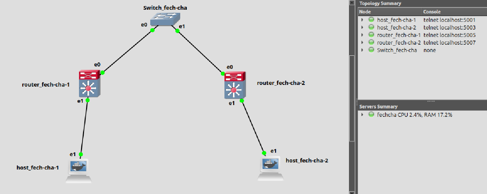

### **Packet Flow from `host_fech-cha-1` to `host_fech-cha-2` (VXLAN with Multicast)**  

When **`host_fech-cha-1` (30.1.1.1)** sends a packet to **`host_fech-cha-2` (30.1.1.2)**, the following sequence occurs:

---

### **Step 1: Packet Generation (L2 Frame)**
- `host_fech-cha-1` sends a packet to `host_fech-cha-2`.  
- Since the two hosts are in different physical locations, the packet first reaches `router_fech-cha-1` via `eth1`.  

---

### **Step 2: Router 1 (router_fech-cha-1) Processing**
- **Layer 2 Lookup (Bridge Forwarding)**  
  - `router_fech-cha-1` has a Linux bridge (`br0`) that connects `eth1` and `vxlan10`.  
  - The bridge checks its MAC address table. If it knows the MAC of `host_fech-cha-2`, it forwards directly via VXLAN.  
  - If the MAC is unknown, it floods the packet over the VXLAN (just like a regular switch does in Ethernet).  

- **VXLAN Encapsulation**  
  - The packet is encapsulated into a VXLAN frame.  
  - VXLAN ID: `10` (configured in `vxlan10`).  
  - Outer **source IP**: `10.1.1.1` (Router 1 eth0).  
  - Outer **destination IP**: `239.1.1.1` (Multicast group).  
  - **UDP Port**: `4789` (VXLAN default).  
  - This encapsulated VXLAN frame is sent out via `eth0` into the multicast group `239.1.1.1`.

---

### **Step 3: Multicast Transmission in Underlay Network**
- The switch (`Switch1`) is responsible for forwarding the multicast traffic.  
- Since `router_fech-cha-2` has also joined the multicast group `239.1.1.1`, it receives the VXLAN-encapsulated frame.  

---

### **Step 4: Router 2 (router_fech-cha-2) Processing**
- **VXLAN Decapsulation**  
  - `router_fech-cha-2` receives the multicast packet on `eth0` (10.1.1.2).  
  - It recognizes that the VXLAN ID is `10` (which matches its `vxlan10` interface).  
  - The VXLAN encapsulation is removed, and the original Ethernet frame is extracted.  

- **Layer 2 Forwarding (Bridge Processing)**  
  - The bridge (`br0`) sees the packet and forwards it to `eth1`.  

---

### **Step 5: Host 2 (host_fech-cha-2) Receives the Packet**
- The packet arrives at `host_fech-cha-2` (`30.1.1.2`), completing the communication.

---

## **How Multicast Works in VXLAN Here**
- **Why Multicast?**  
  - Multicast (`239.1.1.1`) allows `router_fech-cha-2` to dynamically learn about `router_fech-cha-1` without needing static tunnel configurations.  
  - Any new VXLAN Tunnel Endpoints (VTEPs) joining `239.1.1.1` will also receive VXLAN traffic.  

- **Does Host 3 Receive the Traffic?**  
  - No, unless `router_fech-cha-3` (if it exists) has a VXLAN interface (`vxlan10`) and joins `239.1.1.1`.  
  - Multicast ensures efficient delivery only to routers subscribed to the group.  


---

### **Network Topology (Simplified)**
```
   [host_fech-cha-1]        [host_fech-cha-2]
          |                        |
        (eth1)                   (eth1)
          |                        |
   [router_fech-cha-1]        [router_fech-cha-2]
        (br0)                    (br0)
       /     \                   /     \
  (vxlan10)  (eth0)------(Switch1)------(eth0) (vxlan10)
                          |
                     Multicast Group
                      239.1.1.1
```

---

### **Step-by-Step Packet Flow (Text Illustration)**  

#### **1️⃣ Host 1 sends a packet to Host 2**
```
[host_fech-cha-1]  ---->  [router_fech-cha-1] (via eth1)
       (Original Frame: Src=30.1.1.1, Dst=30.1.1.2)
```

#### **2️⃣ Router 1 encapsulates the packet in VXLAN and sends it to multicast group**
```
[router_fech-cha-1] --Encapsulate VXLAN--> (eth0) -->  [Switch1]
       (VXLAN Encapsulated: 
        Outer Src IP = 10.1.1.1, Outer Dst IP = 239.1.1.1, VXLAN ID = 10)
```

#### **3️⃣ Switch1 forwards the VXLAN multicast to all members**
```
[Switch1]  --- Multicast 239.1.1.1 --->  [router_fech-cha-2] (eth0)
```

#### **4️⃣ Router 2 receives the VXLAN packet and decapsulates it**
```
[router_fech-cha-2] -- Decapsulate --> (br0)
       (Extracted Frame: Src=30.1.1.1, Dst=30.1.1.2)
```

#### **5️⃣ Router 2 forwards the packet to Host 2 via eth1**
```
[router_fech-cha-2] ----> [host_fech-cha-2] (via eth1)
```

#### **6️⃣ Host 2 receives the packet**
```
[host_fech-cha-2] 📨 Packet received!
```

---

### **Key Points**
- **VXLAN encapsulation** adds an outer IP header (10.1.1.1 → 239.1.1.1) for multicast delivery.
- **Switch1 acts as a multicast router**, delivering packets to all devices in `239.1.1.1`.
- **Router 2 decapsulates VXLAN** and forwards the packet to Host 2.
- **Multicast ensures dynamic forwarding**, eliminating the need for static tunnels.
