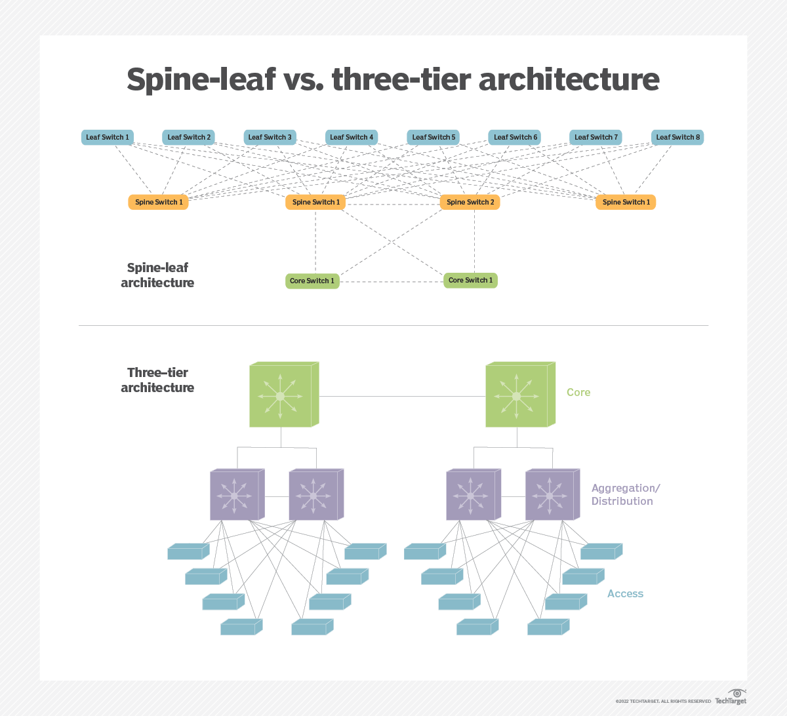

Both architectures in the diagram appear to have three layers, but their **design philosophy and efficiency differ significantly**. Here's why **spine-leaf is generally more efficient than the traditional three-tier model**:

---

### **1. Structure Differences**  
- **Spine-Leaf Architecture:**
  - Has **only two layers** functionally:
    - **Leaf Layer** (blue): Directly connects to servers and devices.
    - **Spine Layer** (orange): Connects all leaf switches.
  - Every leaf switch is connected to every spine switch, creating a **non-blocking, high-bandwidth network**.
  - The core (green) is optional or used for external connectivity.

- **Three-Tier Architecture:**
  - Has **three layers**:
    - **Access Layer** (blue): Connects to end devices.
    - **Aggregation/Distribution Layer** (purple): Interconnects access switches.
    - **Core Layer** (green): Handles backbone traffic and routing.
  - Traffic must **pass through multiple hops** to reach another access layer device, introducing potential bottlenecks.

---

### **2. Efficiency & Performance**
#### ✅ **Spine-Leaf Advantages:**
1. **Equal Latency & Load Balancing**  
   - Each leaf switch connects to all spine switches, ensuring **consistent latency and bandwidth**.
   - Traffic can take multiple paths (ECMP - Equal Cost Multi-Path), preventing congestion.

2. **Better Scalability**  
   - You can scale horizontally by **adding more leaf switches** without redesigning the network.
   - New switches connect to all spine switches, maintaining the same latency and redundancy.

3. **More Redundant & Resilient**  
   - If a spine switch fails, traffic automatically reroutes through the remaining spines.
   - There’s **no single point of failure** at the aggregation layer, unlike in three-tier architecture.

#### ❌ **Three-Tier Limitations:**
1. **Higher Latency & Bottlenecks**  
   - Traffic often passes through multiple switches, increasing delay.
   - Aggregation layer **can become a bottleneck** under high traffic.

2. **Less Scalable**  
   - Scaling requires **reconfiguring aggregation and core layers**, which adds complexity.
   - Can’t easily expand like a spine-leaf architecture.

3. **Higher Complexity in Managing Traffic**  
   - More layers mean **more potential points of failure** and increased network management overhead.

---

### **3. When to Use Each Architecture?**
| Architecture | Best For | Limitations |
|-------------|---------|-------------|
| **Spine-Leaf** | Cloud data centers, high-performance computing, AI workloads, scalable networks | Requires more switch ports & cabling |
| **Three-Tier** | Traditional enterprise networks, smaller networks with moderate traffic | Less scalable, potential bottlenecks |

---

### **Conclusion**
The diagram may show a similar number of **layers**, but in **spine-leaf, traffic moves more efficiently** because:
1. Every **leaf is directly connected** to every spine.
2. There’s **equal latency** and no bottleneck at aggregation.
3. Scaling is **easier** and **more fault-tolerant**.

So, **spine-leaf is more efficient** for large, scalable networks like **data centers** and **cloud computing environments**. 🚀