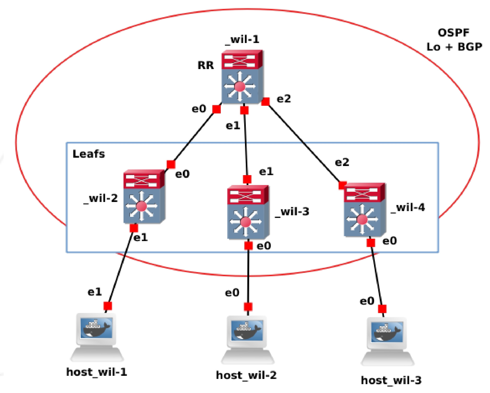
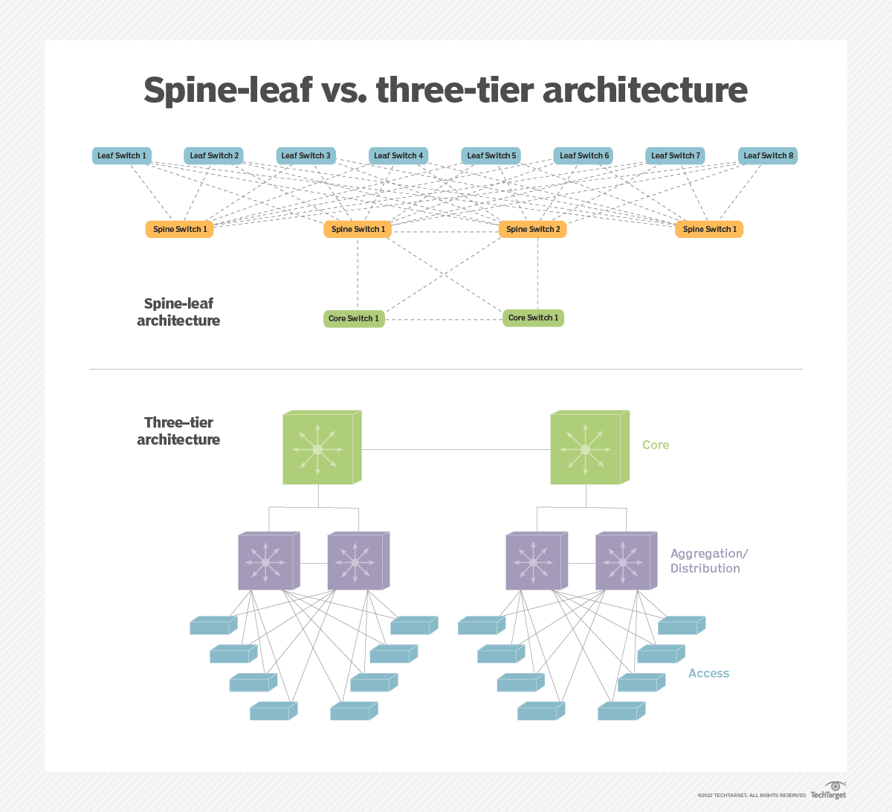

# P3 explanation and turtorial : 


-https://www.youtube.com/watch?v=Ek7kFDwUJBM&t=311s

1. **Understanding the Network Architecture**  
   - What this topology represents  
   - How routing protocols (OSPF and BGP) work in this design  
   - The role of VXLAN and bridging  
   
2. **Key Networking Concepts You Should Study**  
   - OSPF  
   - BGP and Route Reflectors  
   - EVPN (Ethernet VPN)  
   - VXLAN (Virtual eXtensible LAN)  
   - Bridging  

3. **Detailed Explanation of the Configuration**  
   - Breakdown of each router's configuration  
   - What each command does  
   - How everything comes together  

---

## **1. Understanding the Network Architecture**



### **Spine-Leaf Topology**
The topology shown is a **spine-leaf network**, commonly used in **data centers** to provide high performance and scalability.  

- **Spine (Router Reflector - _wil-1_):**  
  - This acts as the **central point for BGP route reflection**.  
  - It ensures all leaf switches get the necessary routing information.  
  - Uses **OSPF for internal routing** and **BGP (EVPN) for VXLAN overlay**.  
  - Connected to multiple leaf switches.  

- **Leafs (_wil-2, wil-3, wil-4_):**  
  - These act as Layer 2 and Layer 3 forwarding devices.  
  - They are connected to hosts and also to each other via the spine.  
  - They **run OSPF for underlay** and **BGP EVPN for VXLAN overlay**.  

- **Useful resource:**
    - https://www.youtube.com/watch?v=xjc7WLBb-nI
    - https://www.techtarget.com/searchdatacenter/definition/Leaf-spine
    - `spine_leaf.md` in the same folder


### **Routing and Forwarding Mechanisms**
1. **Underlay Routing - OSPF**  
   - Used for basic **IP connectivity** between routers.  
   - Runs between the spine and the leafs.  
   - Allows routers to **discover and exchange reachability information**.  

2. **Overlay Routing - BGP EVPN**  
   - BGP (Border Gateway Protocol) is used with **EVPN (Ethernet VPN)**.  
   - Allows **VXLAN tunnels** to be established dynamically.  
   - Enables **Layer 2 and Layer 3 connectivity across multiple hosts** in different leaf switches.  
   - Uses **Route Reflector** (_wil-1_) to avoid full-mesh BGP connections.  

3. **VXLAN - Extending Layer 2 Networks Over Layer 3**  
   - VXLAN allows **Layer 2 segments to be extended** over an IP network.  
   - Uses **VNI (VXLAN Network Identifier)** to distinguish different segments.  
   - Uses **UDP encapsulation (Port 4789)**.  

4. **Bridging - Connecting Network Segments**  
   - Each leaf switch has a **software bridge (`br0`)** to link VXLAN and physical interfaces.  
   - Allows **local communication between VMs/containers** connected to the same leaf.  

---

## **2. Key Networking Concepts You Should Study**
To fully grasp this setup, you need to study:  

1. **OSPF (Open Shortest Path First)**
   - How **OSPF works as a link-state protocol**.  
   - **Area concepts** and how OSPF is used for **underlay IP routing**.  

2. **BGP (Border Gateway Protocol)**
   - **iBGP vs. eBGP**.  
   - **Route Reflectors** (avoid full mesh requirement).  
   - **BGP EVPN** for VXLAN.  

3. **VXLAN (Virtual eXtensible LAN)**
   - How VXLAN enables **Layer 2 extension over Layer 3**.  
   - **Encapsulation, VNIs, and multicast/unicast transport modes**.  

4. **EVPN (Ethernet VPN)**
   - How **BGP EVPN is used to exchange MAC/IP information**.  
   - How EVPN solves **Layer 2 flooding and MAC learning issues**.  

5. **Linux Networking Basics**
   - **Bridges (`brctl`)** and how they connect interfaces.  
   - **VXLAN interface creation in Linux**.  

---

## **3. Detailed Explanation of Configurations**

Now, let's go **line by line** through the configurations.

### **Spine (_wil-1_) Configuration**
```sh
vtysh
conf t
```
- `vtysh`: Opens the **FRRouting CLI** (like Cisco's IOS CLI).  
- `conf t`: Enters **configuration mode**.  

#### **Interface Configuration**
```sh
interface eth0
 ip address 10.1.1.1/30
 ip ospf area 0
```
- Assigns **IP 10.1.1.1/30** to `eth0` and places it in **OSPF Area 0** (the backbone area).  

```sh
interface eth1
 ip address 10.1.1.5/30
 ip ospf area 0
```
- Similar for `eth1` (connected to `_wil-3_`).  

```sh
interface eth2
 ip address 10.1.1.9/30
 ip ospf area 0
```
- Same for `eth2` (connected to `_wil-4_`).  

```sh
interface lo
 ip address 1.1.1.1/32
 ip ospf area 0
```
- **Loopback interface**: Used for **BGP peering and route reflection**.  

#### **BGP Configuration**
```sh
router bgp 1
 neighbor ibgp peer-group
 neighbor ibgp remote-as 1
 neighbor ibgp update-source lo
```
- Enables **BGP AS 1**.  
- Creates a **peer group** (`ibgp`) to simplify configuration.  
- Uses **loopback (`lo`) as the source IP** for stability.  

```sh
bgp listen range 1.1.1.0/29 peer-group ibgp
```
- Listens for **peers in the range 1.1.1.0/29** and assigns them to the peer group.  

```sh
address-family l2vpn evpn
  neighbor ibgp activate
  neighbor ibgp route-reflector-client
exit-address-family
```
- Activates **L2VPN EVPN**, which is needed for **VXLAN over BGP**.  
- **Route Reflector (`route-reflector-client`)** ensures BGP updates are forwarded to all peers.  

#### **OSPF Configuration**
```sh
router ospf
```
- Enables **OSPF as the underlay routing protocol**.  

---

### **Leaf (_wil-2, wil-3, wil-4_) Configuration**
```sh
ip link add br0 type bridge
ip link set dev br0 up
ip link add vxlan10 type vxlan id 10 dstport 4789
ip link set dev vxlan10 up
brctl addif br0 vxlan10
brctl addif br0 eth0
```
- Creates **a bridge (`br0`)** to connect VXLAN and physical interfaces.  
- **`vxlan10`** is the VXLAN interface with **VNI 10 and UDP port 4789**.  
- The bridge connects **VXLAN (`vxlan10`) and the physical interface (`eth0` or `eth1`)**.  

#### **Interface Configuration**
```sh
interface eth0
 ip address 10.1.1.2/30
 ip ospf area 0
```
- Assigns an IP to `eth0` and enables OSPF.  

#### **BGP Configuration**
```sh
router bgp 1
 neighbor 1.1.1.1 remote-as 1
 neighbor 1.1.1.1 update-source lo
```
- Connects to the **Route Reflector (_wil-1_)** using **loopback**.  

```sh
address-family l2vpn evpn
  neighbor 1.1.1.1 activate
  advertise-all-vni
exit-address-family
```
- Enables **L2VPN EVPN**.  
- Advertises **all VNIs (VXLAN Networks)** to ensure connectivity.  

---

## **Final Thoughts**
This setup **extends Layer 2 networks over Layer 3** using **VXLAN + BGP EVPN**. To master it, study:
1. **OSPF for underlay routing**
2. **BGP with Route Reflectors**
3. **VXLAN for Layer 2 overlay**
4. **EVPN for BGP MAC/IP learning**
5. **Linux networking commands (`ip link`, `brctl`)**

Would you like me to help with troubleshooting or verification commands? 🚀