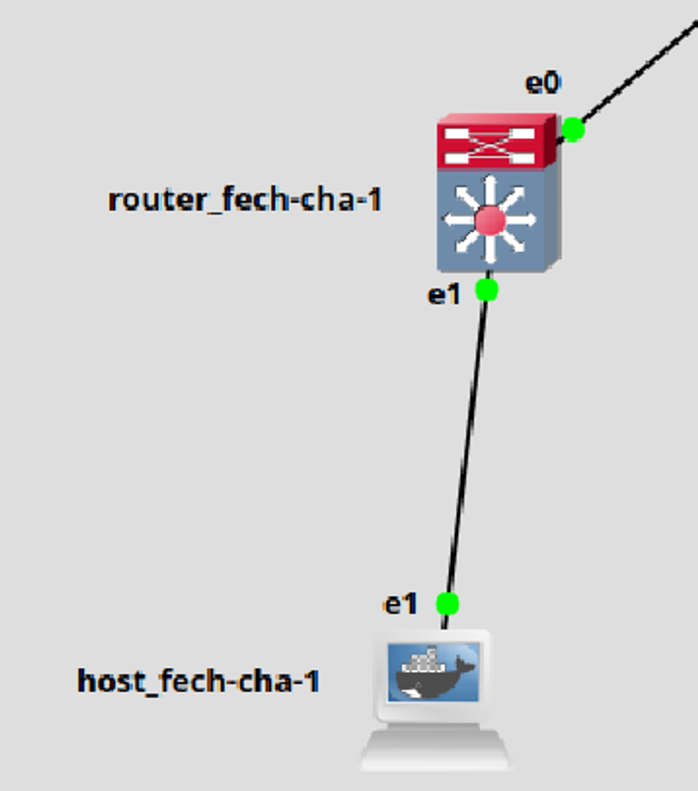

### **Detailed Explanation of the VXLAN Setup in This Small Topology**  

This section explains the **VXLAN configuration and traffic flow** for `router_fech-cha-1` in the given topology. The goal is to establish a **Layer 2 (L2) connection** between `host_fech-cha-1` and a remote host via VXLAN, using `router_fech-cha-1` as a **VTEP (VXLAN Tunnel Endpoint)**.  

---

## **1️⃣ Components of the Topology**
```
+------------------------+       +------------------------+
|  host_fech-cha-1       |       |  router_fech-cha-1     |
|  [eth1] --- (L2) ----> |  [eth1]                      |
|                        |       |   +----------------+   |
|                        |       |   | br0 (bridge)   |   |
|                        |       |   +----------------+   |
|                        |       |         |   |         |
|                        |       |      [eth1] [vxlan10] |
+------------------------+       +------------------------+
```
- **`host_fech-cha-1`**: Sends standard Ethernet frames via its `eth1`.  
- **`router_fech-cha-1`**:  
  - **Receives** those frames on `eth1`.  
  - **Bridges** `eth1` and `vxlan10` via `br0`.  
  - **Encapsulates frames** into VXLAN and sends them over the L3 underlay.  

---

## **2️⃣ Command Breakdown & Explanation**  

### **Step 1: Create a Linux Bridge (`br0`)**
```bash
ip link add br0 type bridge
ip link set dev br0 up
```
- `br0` is a **Layer 2 bridge (switch)** inside `router_fech-cha-1`.  
- It will **connect `eth1` (the local interface) and `vxlan10` (the VXLAN tunnel interface)**.  
- Enabling `br0` allows frames to flow between interfaces.  

---

### **Step 2: Assign an IP Address to `eth0` (Underlay Network)**
```bash
ip addr add 10.1.1.1/24 dev eth0
```
- `eth0` is the **underlay network interface**, responsible for transporting VXLAN packets.  
- `10.1.1.1/24` is the **local VTEP IP** that will be used for VXLAN communication.  

---

### **Step 3: Create the VXLAN Tunnel Interface (`vxlan10`)**
```bash
ip link add name vxlan10 type vxlan id 10 dev eth0 group 239.1.1.1 dstport 4789
```
- **Creates a VXLAN interface (`vxlan10`)** to encapsulate Layer 2 frames over Layer 3.  
- **Breakdown of the parameters:**  
  - `id 10` → VXLAN Network Identifier (**VNI 10**, like a VLAN ID).  
  - `dev eth0` → Uses `eth0` for transport (the underlay network).  
  - `group 239.1.1.1` → Uses **multicast group 239.1.1.1** for VXLAN learning.  
  - `dstport 4789` → Standard VXLAN UDP port.  

---

### **Step 4: Assign an IP Address to the VXLAN Interface**
```bash
ip addr add 20.1.1.1/24 dev vxlan10
```
- `20.1.1.1/24` is the **overlay network IP** assigned to `vxlan10`.  
- This IP is used for **Layer 2 communication between remote VXLAN endpoints**.  

---

### **Step 5: Bridge `eth1` (Host Interface) and `vxlan10`**
```bash
brctl addif br0 eth1
brctl addif br0 vxlan10
```
- This command **adds both `eth1` and `vxlan10` to `br0`**, meaning:  
  1. Any **frame received from `host_fech-cha-1` on `eth1`** can be **forwarded to `vxlan10`**.  
  2. Any **frame received on `vxlan10` from the VXLAN tunnel** can be **forwarded to `eth1`**.  

---

### **Step 6: Enable the VXLAN Interface**
```bash
ip link set dev vxlan10 up
```
- Activates the VXLAN tunnel interface so that it can start forwarding traffic.  

---

## **3️⃣ VXLAN Traffic Flow**
Now that everything is configured, let's see how traffic moves:

1. **Host Sends a Frame**  
   - `host_fech-cha-1` sends an Ethernet frame destined for a remote host.  
   - This frame **enters `eth1` on `router_fech-cha-1`**.  

2. **Frame is Bridged**  
   - `br0` **forwards the frame** to `vxlan10` because both `eth1` and `vxlan10` are part of the bridge.  

3. **VXLAN Encapsulation**  
   - `vxlan10` **encapsulates the frame inside a VXLAN packet**.  
   - The **original Ethernet frame** is now inside a **UDP packet with VXLAN headers**.  

4. **Packet Sent to the VXLAN Multicast Group**  
   - The encapsulated VXLAN packet is sent to the **multicast group 239.1.1.1**.  
   - Any other **VXLAN router (VTEP) listening to this group will receive it**.  

5. **Remote VTEP Decapsulates the Packet**  
   - The **destination VXLAN router (e.g., `router_fech-cha-2`)** receives the packet.  
   - It **removes the VXLAN header** and **forwards the original Ethernet frame** to its local `eth1`.  

6. **Remote Host Receives the Frame**  
   - The frame reaches the **destination host**, as if it traveled over a normal Layer 2 switch.  

---

## **4️⃣ Key Takeaways**
1. **`br0` inside `router_fech-cha-1` acts as a software-based switch**, connecting `eth1` (the local host-facing interface) with `vxlan10` (the VXLAN tunnel interface).  
2. **Frames from `host_fech-cha-1` enter `eth1`, are bridged to `vxlan10`, encapsulated in VXLAN, and sent over the network**.  
3. **Multicast (`group 239.1.1.1`) is used for VXLAN learning**, allowing dynamic discovery of remote VTEPs.  
4. **`eth1` in the bridge is the interface on `router_fech-cha-1`**, NOT the host’s `eth1`.  

